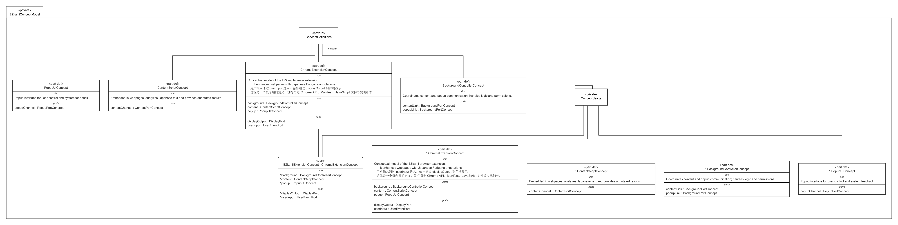

# EZkanji Concept Model  
*A Lightweight Proof-of-Concept System for Evaluating the Feasibility of Browser-Based Japanese Learning Assistants*

---

## 1. Goal of the Concept

The goal of this concept is to **design a lightweight proof-of-concept system** to evaluate the feasibility of a **browser-based Japanese learning assistant**.  
The system, modeled as a **Chrome Extension**, aims to analyze Japanese text appearing on webpages and automatically add **Furigana (phonetic annotations)** above Kanji characters to support learners’ reading comprehension.

Rather than implementing the full extension, this concept focuses on **verifying the architectural and interaction feasibility** of the system — demonstrating that user inputs, message flows, and annotation outputs can operate cohesively within a minimal browser-based environment.

---

## 2. Approach to the Concept Creation

The concept was developed through a **model-based systems engineering (MBSE)** approach using **SysML v2** to abstract and formalize the system architecture prior to any coding.

### Methodology

1. **Functional Analysis** – Identify core user needs:
   - Select text on a webpage.
   - Request annotation or translation.
   - View results through a popup interface.
2. **System Layering** – Organize logic into three conceptual layers:
   - **Execution Layer (Content Script)** – text analysis and Furigana generation.  
   - **Logic Layer (Background Controller)** – coordination and message routing.  
   - **UI Layer (Popup UI)** – handles user control and displays results.
3. **Interface Abstraction** – Replace Chrome APIs with **conceptual ports and interfaces** (`ContentPortConcept`, `PopupPortConcept`, `BackgroundPortConcept`) to represent message flow logically.
4. **Behavior Allocation** – Assign abstract `actions` (`analyzeText`, `addFurigana`, `relayMessages`, `toggleExtension`) to clarify responsibilities for each subsystem.

### Design Rationale

This approach provides:
- Early feasibility verification before implementation.  
- Clear architectural separation between user interaction, logic, and execution layers.  
- A reusable conceptual foundation for the later **Proof-of-Concept System**.

---

## 3. List of the Main Components

| Component | SysML v2 Element | Description |
|------------|------------------|--------------|
| **Chrome Extension Concept** | `ChromeExtensionConcept` | The top-level conceptual boundary combining all subsystems. |
| **Content Script Module** | `ContentScriptConcept` | Embedded in the webpage; analyzes text and adds Furigana annotations. |
| **Background Controller** | `BackgroundControllerConcept` | Manages data flow and system logic between popup and content layers. |
| **Popup UI** | `PopupUIConcept` | Provides user control and visual feedback for annotations. |
| **User Event Port** | `UserEventPort` | Entry point for user actions such as clicks or text selections. |
| **Display Output Port** | `DisplayPort` | Represents the output channel for annotated text display. |

### Conceptual Data Flow
1. `contentToBackground` – simulates in-page script to background communication.  
2. `popupToBackground` – handles user commands from popup UI.  
3. `popupToDisplay` – outputs results to the display interface.

---

## 4. Draft Plan for Implementation

Although this model is conceptual, it defines a clear path for implementation and proof-of-concept validation.

### Step 1 – Develop Front-End Prototype
- Implement popup UI and inject basic content scripts.
- Display mock annotations to verify user flow.

### Step 2 – Integrate Kanji Data API
- Connect to an external dictionary (e.g., JMdict).
- Generate real Furigana annotations from text content.

### Step 3 – Implement Background Message Routing
- Bridge popup, background, and content layers via Chrome messaging.
- Validate message timing and response structure.

### Step 4 – Conduct User Testing
- Observe learners using the system on real webpages.
- Gather feedback on usability and annotation clarity.

### Step 5 – Extend to Proof-of-Concept System
- Instantiate `ChromeExtensionConcept` as `ProofOfConcept_EZkanjiSystem`.
- Connect conceptual ports to simulated input/output channels.

---

## Traceability to Proof-of-Concept

The **EZkanji Concept Model** serves as the **architectural foundation** for the `EZkanji Proof-of-Concept System.sysml`.  
Each conceptual component defined here is instantiated in the PoC model:

| Conceptual Element | Proof-of-Concept Instance |
|--------------------|---------------------------|
| `ChromeExtensionConcept` | `ProofOfConcept_EZkanjiSystem` |
| `ContentScriptConcept` | `contentInstance` |
| `BackgroundControllerConcept` | `backgroundInstance` |
| `PopupUIConcept` | `popupInstance` |

This traceability ensures the transition from theoretical design to system validation is verifiable and consistent.

---

## Visual Representation

The following diagram provides an overview of the **conceptual-to-POC architecture**, illustrating the main data flow and subsystem interactions.

To complement the static diagram, the following prototype demonstration video showcases the **POC model in action**, highlighting component interaction, event flow, and user interface behavior.

<video controls preload="metadata" width="720" poster="cover.png">
  <source src="prototype.mp4" type="video/mp4">
  Your browser does not support the video tag.
</video>

---
