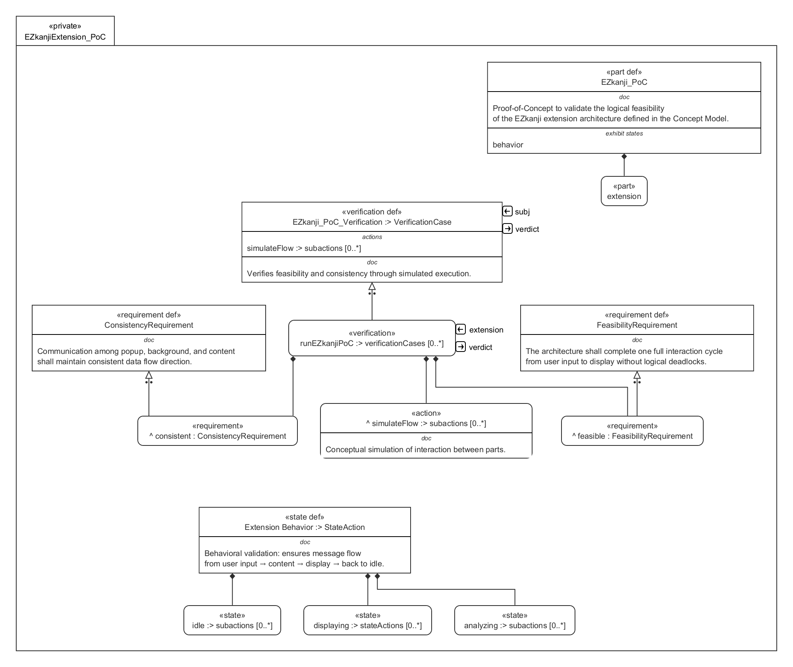

# Proof-of-Concept (POC) Documentation

The purpose of this Proof-of-Concept (POC) is to validate the core feasibility, structural integrity, and functional assumptions derived from the **Conceptual System Model**. It was created to demonstrate how key conceptual elements can be realized through minimal but representative implementations. This POC focuses on verifying integration pathways, interaction logic, and data flow consistency between subsystems—serving as a bridge between theoretical modeling and practical realization. Simplifications and mock components were introduced where full-scale implementation was unnecessary for proof purposes.

---

## Traceability Table: Conceptual Model → POC Model

| **Conceptual Model Element** | **POC Model Element** | **Transformation & Implementation Insight** |
|-------------------------------|------------------------|---------------------------------------------|
| **User Interaction Interface** | Chrome Extension Popup UI | The abstract "User Interface" concept was realized using a lightweight HTML/CSS/JS frontend rendered through Chrome’s extension popup. Simplified user workflows and minimal styling were applied to validate usability and system event flow. |
| **Data Processing Core** | Background Script (Service Worker) | The conceptual processing engine was implemented as a background service worker to handle asynchronous events, maintain state, and process user data. Core logic modules were isolated for easier debugging and extension. |
| **Local Storage Layer** | Chrome Storage API | The abstract data persistence layer was translated to Chrome’s local storage mechanism. Simplified schema mapping ensured efficient read/write operations within browser constraints. |
| **External Integration Gateway** | REST API Mock Endpoint | Instead of full API integration, a mock REST endpoint simulated data exchange between the extension and an external server, validating network request handling and response parsing. |
| **Security & Access Control** | Permission Management (manifest.json) | Conceptual access policies were implemented via Chrome’s manifest permission declarations, validating safe runtime operations and limiting external access. |
| **Telemetry & Logging Subsystem** | Console Logger + Debug Panel | The conceptual monitoring system was reduced to console-based telemetry for event tracking and debugging. The logging strategy ensured transparency without adding performance overhead. |
| **Configuration Manager** | Config File + Environment Variables | Conceptual configuration logic was embodied as static JSON configuration files, supporting quick adjustments and validating the flexibility of parameter management. |

---

### Summary

This POC successfully demonstrates that the conceptual design can be instantiated within a constrained, browser-based environment while maintaining modularity and traceable system relationships. Insights gained from this prototype will inform architectural refinement, scalability evaluation, and component-level optimization in subsequent development phases.

---